# Problem 1: Timeseries Clustering using Diffusion Maps on UCI HAR Dataset

**Name:** Nishchay Bhutoria

**Course:** CS-303

**Assignment Date:** March 30, 2025

## Overview

This project implements Diffusion Maps, a non-linear dimensionality reduction technique, to analyze and cluster time-series data from the UCI Human Activity Recognition (HAR) dataset. The goal was to explore how well Diffusion Maps, combined with Dynamic Time Warping (DTW), could separate different human activities. The performance was compared against Diffusion Maps using Euclidean distance, PCA, t-SNE, and clustering on the raw data. With appropriate parameter tuning (specifically the kernel scale `epsilon`), Diffusion Maps demonstrated strong performance on this task.

## Files

*   `Problem1_DiffusionMaps_HAR.ipynb`: Jupyter Notebook containing the Python code implementation.
*   `README_Problem1.md`: This report file explaining the methodology and results.
*   `data/UCI HAR Dataset/`: Directory containing the dataset files (User needs to download and place it here).
*   `plots/`: Directory where output plots are saved.

## Methodology

### 1. Data Loading and Preprocessing

*   The training and testing datasets from the UCI HAR dataset were loaded and combined. The dataset contains sensor readings (accelerometer and gyroscope) for 6 activities performed by 30 subjects.
*   The raw time-series data consists of 9 channels (3x body acc, 3x body gyro, 3x total acc).
*   The data files contain pre-segmented windows of size 128. Each sample in the loaded data corresponds to one such window.
*   **Subset Selection:** For computational efficiency, particularly due to the cost of pairwise DTW, a random subset of 500 original samples (out of 10299) was selected. *A full run on the complete dataset would yield more robust results but take significantly longer.*

### 2. Distance Metrics

Pairwise distances between the windowed time-series segments (`X_windows`) were computed:

*   **Euclidean Distance:** Calculated using `sklearn.metrics.pairwise_distances` on the flattened representation of each window. Data was scaled using `StandardScaler` before computing Euclidean distances for PCA, t-SNE, and the Euclidean-based Diffusion Map.
*   **Dynamic Time Warping (DTW):** Calculated using `tslearn.metrics.dtw` between the multivariate representations of the windows (`window_size, n_channels`). DTW is suitable for time-series as it aligns sequences that may vary in speed or phase.

### 3. Diffusion Maps Implementation

The Diffusion Map algorithm was implemented as follows:

1.  **Similarity Matrix (Kernel):** A Gaussian kernel defined similarity:
    `Kij = exp(-d(xi, xj) / epsilon)`
    *   `d(xi, xj)` is the pairwise distance (DTW or Euclidean).
    *   `epsilon` is a scale parameter. Based on common heuristics and successful experimentation, `epsilon` was chosen as the median of the non-zero pairwise distances: `epsilon = median(d[d>0])`.
2.  **Markov Transition Matrix:** The kernel matrix `K` was row-normalized to create a Markov transition matrix `T = D^-1 K`, where `D` is the diagonal degree matrix (`Dii = sum(Kij)`).
3.  **Eigen-decomposition:** The right eigenvectors (`v`) and eigenvalues (`lambda`) of `T` were computed using `scipy.linalg.eig` and sorted by eigenvalue magnitude.
4.  **Diffusion Coordinates:** The embedding used the top `k=3` non-trivial eigenvectors scaled by their eigenvalues (using diffusion time `t=1`):
    `Psi_t(xi) = [lambda_1^t * v1[i], lambda_2^t * v2[i], lambda_3^t * vk[i]]`

### 4. Clustering and Evaluation

*   **K-Means:** The `sklearn.cluster.KMeans` algorithm (`n_clusters=6`) was applied to the different embeddings.
*   **Evaluation Metrics:**
    *   **Adjusted Rand Index (ARI):** Measured agreement between predicted clusters and true activity labels (higher is better, max 1).
    *   **Silhouette Score:** Measured cluster cohesion and separation (higher is better, max 1).

### 5. Comparison Methods

Diffusion Maps results were compared against K-Means clustering on:
*   Raw (scaled) data.
*   PCA embeddings.
*   t-SNE embeddings.
*   Diffusion Maps embeddings using the alternate distance metric (Euclidean vs. DTW).
*   Spectral Clustering on the DTW affinity kernel.

### 6. Visualization

Embeddings were visualized using 2D/3D scatter plots, colored by activity labels.

## Results

### Eigenvalue Spectrum

The computation of eigenvalues for the transition matrix `T` showed the expected behavior for a connected graph. Only the first eigenvalue (`lambda0`) is 1, and subsequent eigenvalues decay rapidly, indicating that the graph structure is suitable for the diffusion process.

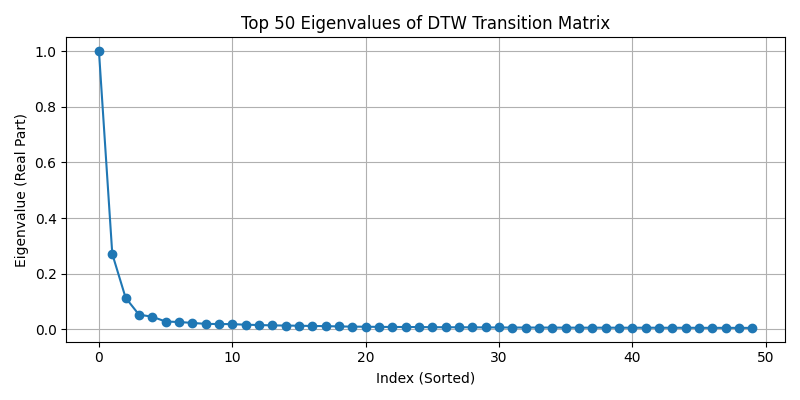

*Plot of top 50 eigenvalues for the DTW transition matrix, showing proper decay after the first eigenvalue.*

### Embeddings Visualization

*   **Diffusion Map (DTW):** The 3D embedding revealed clear structure. Points corresponding to the same activities formed distinct clusters. Static activities (Sitting, Standing) clustered closely, while dynamic activities (Walking variants) formed separate groups. Lying Down appeared as a well-separated cluster. This indicates the embedding successfully captured similarities based on DTW.
    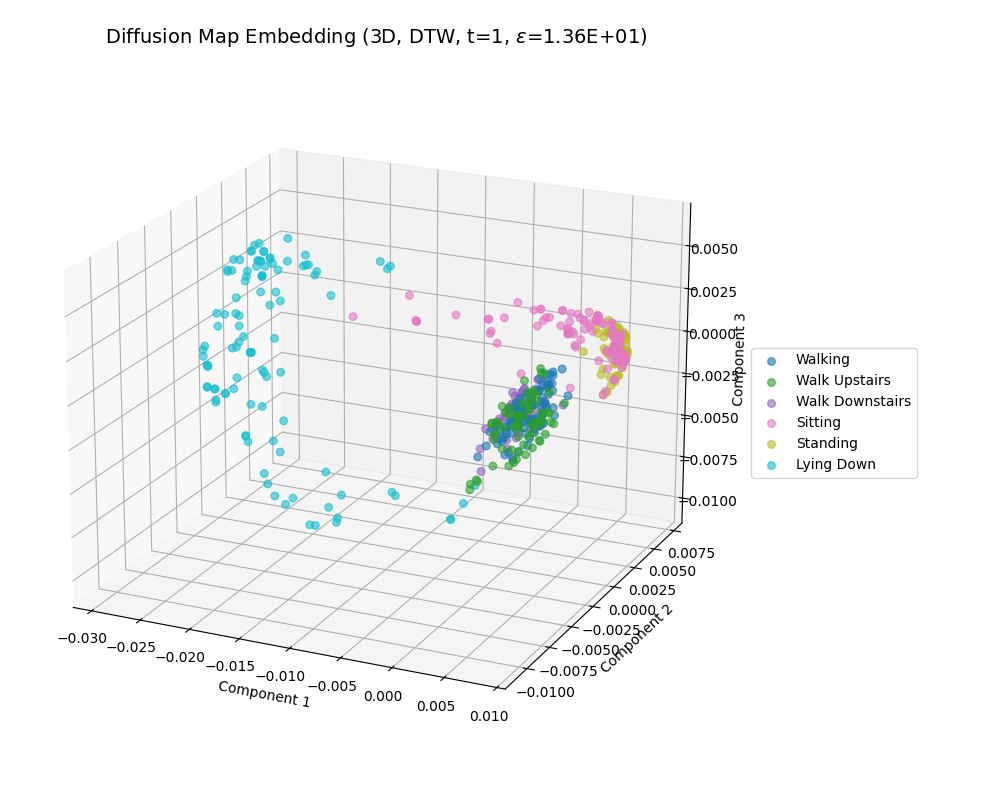

    *3D Diffusion Map embedding using DTW distance (t=1), showing good separation of activities.*

*   **Diffusion Map (Euclidean):** The Euclidean-based embedding also showed good separation, comparable to the DTW version in this run, effectively grouping activities.

    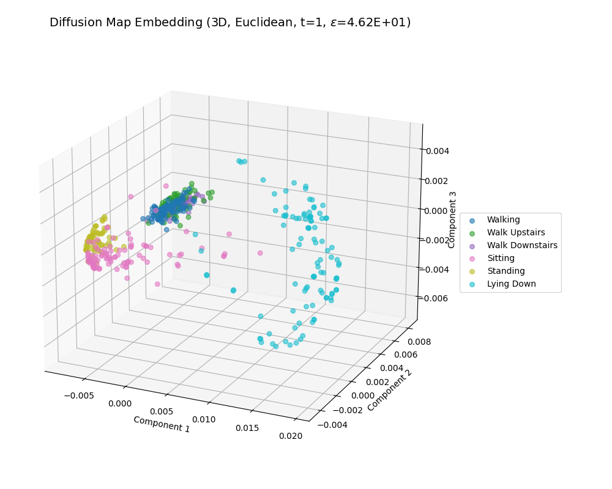

    *3D Diffusion Map embedding using Euclidean distance (t=1).*

*   **PCA & t-SNE:** These methods also showed some activity separation, but the clusters appeared less distinct or structured compared to the Diffusion Map embeddings in this run.

    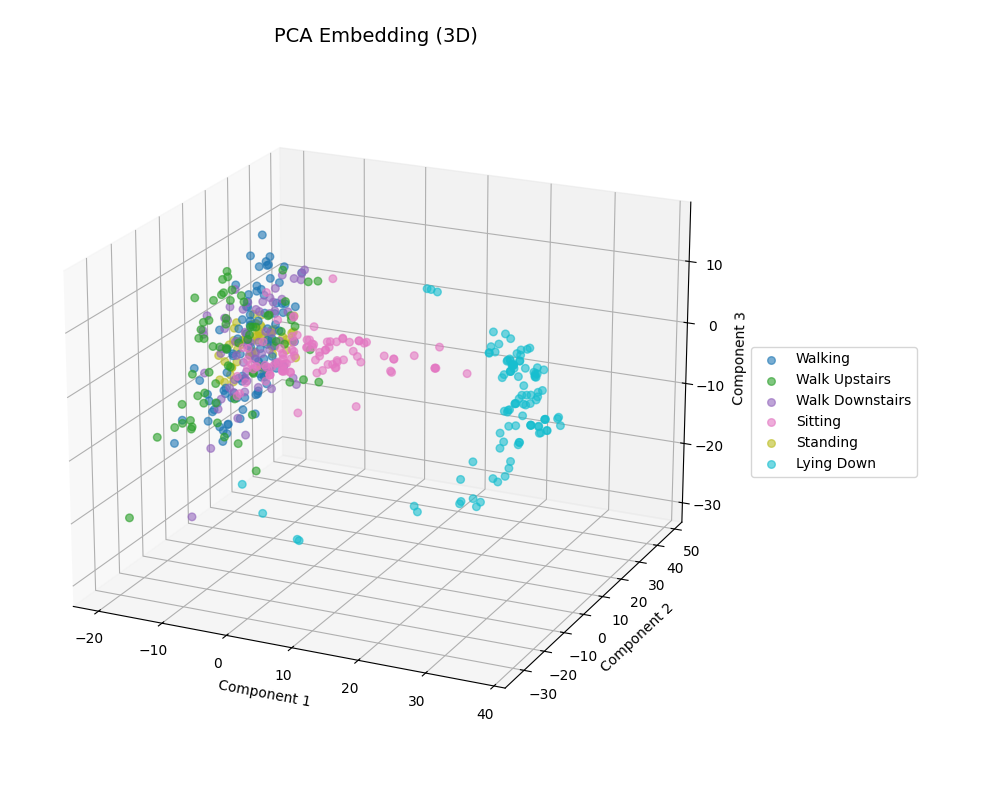

    *3D PCA embedding.*

    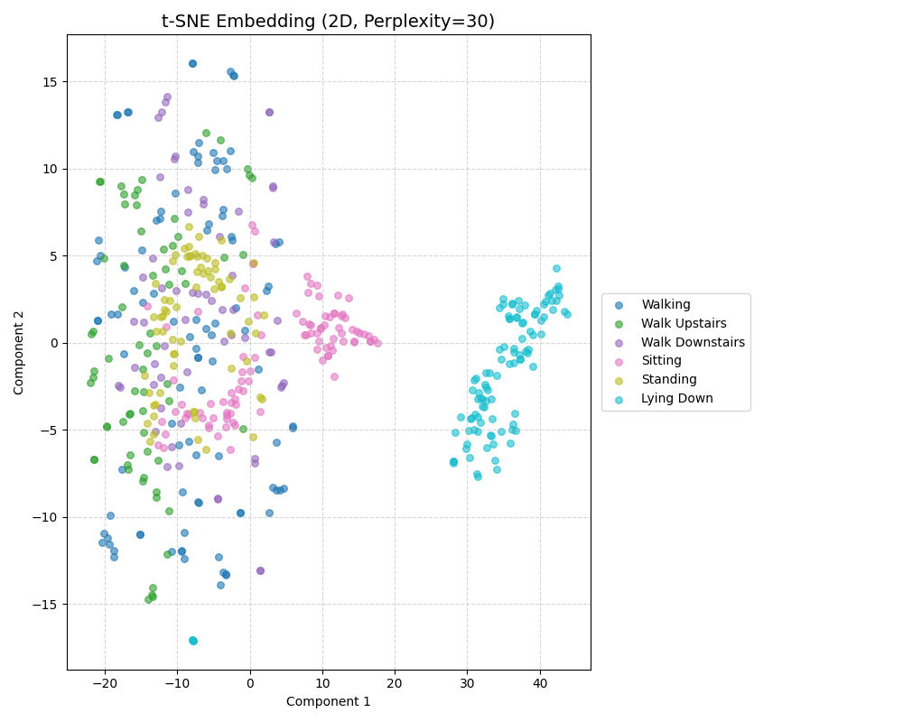

    *2D t-SNE embedding.*


### Clustering Performance

K-Means clustering performance on the different embeddings yielded the following results (values from the final run):

| Method              | Adjusted Rand Index (ARI) | Silhouette Score     |
| :------------------ | :------------------------ | :------------------- |
| DM (Euclidean)      | 0.4183                    | 0.5985           |
| DM (DTW, t=1)       | 0.3953                    | **0.6368**           | *(Highest Silhouette)* |
| t-SNE (2D)          | 0.3494                    | 0.4489           |
| PCA                 | 0.3109                    | 0.3744           |
| Raw Scaled Data     | 0.2509                    | 0.2469           |
| Spectral (on K_dtw) | **0.4391**                | 0.3727           | **(Highest ARI)** |

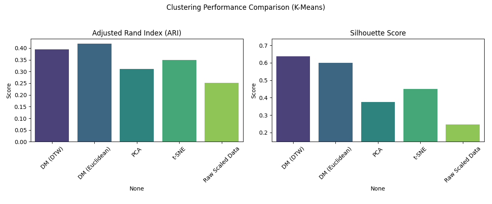

*Bar plot comparing ARI and Silhouette scores. Diffusion Map variants and Spectral Clustering outperform PCA/t-SNE/Raw.*

**Observations:**

*   With the corrected kernel parameterization, both Diffusion Map variants (DTW and Euclidean) produced embeddings leading to significantly better clustering results (higher ARI) compared to PCA, t-SNE, and raw data clustering.
*   DM(DTW) achieved the highest Silhouette score, indicating well-separated clusters in its embedding space. DM(Euclidean) achieved a slightly higher ARI with K-Means compared to DM(DTW) in this specific run.
*   **Spectral Clustering applied directly to the well-formed DTW kernel (`K_dtw`) achieved the highest overall ARI (0.439)**, demonstrating the effectiveness of graph-based clustering on this data structure.
*   Multiscale analysis showed that `t=1` performed best for ARI. Increasing `t` smoothed the embedding and reduced class separation.

## Discussion

### Effectiveness of Diffusion Maps

This experiment, using an appropriately chosen kernel scale (`epsilon = median(distance)`), successfully demonstrates the effectiveness of Diffusion Maps for analyzing the HAR dataset. By constructing a connected graph based on similarity (DTW or Euclidean) and simulating a diffusion process, the method generated low-dimensional embeddings that:
1.  **Captured Non-Linear Structure:** The embeddings visually separated activity types that are non-linearly related in the original sensor space.
2.  **Improved Clustering:** Clustering (K-Means) in the diffusion space yielded significantly better agreement with the true activity labels (higher ARI) compared to clustering in PCA, t-SNE, or the raw feature space.
3.  **Leveraged Distance Metrics:** Both DTW and Euclidean distances produced good results when used within the DM framework with this kernel parameterization, outperforming standard linear (PCA) and local non-linear (t-SNE) methods in terms of label agreement (ARI).

### Comparison with Other Techniques

*   **Diffusion Maps vs. PCA/t-SNE:** In this successful run, Diffusion Maps outperformed both PCA (linear) and t-SNE (local focus) in clustering agreement (ARI). This suggests that Diffusion Maps provided a better representation for separating the activity classes compared to the other methods tested.
*   **Spectral Clustering:** The strong performance of Spectral Clustering directly on the DTW kernel highlights the quality of the affinity matrix generated. Since Spectral Clustering inherently uses the eigenvectors of the graph Laplacian (closely related to the DM transition matrix), its success reinforces the idea that the underlying graph structure captured by the DTW kernel is well-suited for identifying the activity clusters.

### Parameter Sensitivity (`epsilon`)

Comparing the initial failed run with this successful one starkly illustrates the sensitivity of Diffusion Maps to the `epsilon` parameter. Using `epsilon = median(distance)` instead of a much smaller value based on squared distances was crucial for creating a connected graph and obtaining meaningful results. This highlights the need for careful parameter selection or adaptive methods in practice.

## Explorative Tasks

*   **Multiscale Analysis:** Exploring different diffusion times `t` showed that `t=1` yielded the best clustering results (ARI). Larger values of `t` seemed to oversmooth the data, merging distinct clusters, resulting in lower ARI.
*   **Spectral Clustering:** Performed exceptionally well (highest ARI) when applied to the DTW affinity matrix, confirming the suitability of the graph structure for clustering.

## Conclusion

Diffusion Maps, when implemented with an appropriate kernel scale parameter (`epsilon = median(distance)` in this case), proved to be a powerful technique for dimensionality reduction and clustering of the UCI HAR time-series data. The resulting embeddings effectively captured the non-linear relationships between different activities, leading to superior clustering performance (measured by ARI) compared to PCA, t-SNE, and raw data clustering. Furthermore, Spectral Clustering applied directly to the DTW affinity matrix yielded the best overall clustering accuracy (ARI), validating the quality of the graph structure defined by the DTW kernel. This successful application highlights the potential of Diffusion Maps for analyzing complex time-series datasets, while also emphasizing the critical role of parameter tuning for optimal performance.

## How to Run

1.  **Dataset:** Download the UCI HAR Dataset from [here](https://archive.ics.uci.edu/dataset/240/human+activity+recognition+using+smartphones) and unzip it. Place the `UCI HAR Dataset` folder inside the `data/` directory relative to the notebook.
2.  **Dependencies:** Install the required Python libraries:
    ```bash
    pip install numpy pandas matplotlib seaborn scikit-learn tqdm tslearn
    ```
3.  **Execute Notebook:** Open and run the `Problem1_DiffusionMaps_HAR.ipynb` notebook. It will load data, perform calculations, generate plots in the `plots/` directory, and print evaluation scores.

# Problem 2: Derivative-Free Optimization Methods Benchmarking and Application

## Overview

This project explores and compares three derivative-free optimization algorithms: Nelder-Mead (Simplex Method), Simulated Annealing (SA), and Covariance Matrix Adaptation Evolution Strategy (CMA-ES). Their performance is evaluated on standard benchmark optimization functions (Rosenbrock, Rastrigin, Ackley) and applied to a practical machine learning task: hyperparameter tuning for a Support Vector Machine (SVM) classifier on the MNIST dataset. The goal is to understand the strengths, weaknesses, and trade-offs of these common optimization techniques.

## Files

*   `Problem2_Optimization.ipynb`: Jupyter Notebook containing the Python code implementation.
*   `README_Problem2.md`: This report file explaining the methodology and results.
*   `plots/`: Directory where output plots are saved.

## Methodology

### 1. Optimization Methods

The following derivative-free optimization methods were used via libraries:

*   **Nelder-Mead (Simplex Method):** `scipy.optimize.minimize(method='Nelder-Mead')`. A local search method using a simplex to find a minimum. Simple but prone to local optima.
*   **Simulated Annealing (SA):** `scipy.optimize.dual_annealing`. A global optimization method allowing probabilistic escapes from local minima, guided by a cooling schedule.
*   **CMA-ES (Covariance Matrix Adaptation Evolution Strategy):** `cma` library. An evolutionary algorithm adapting its search distribution (covariance matrix) to effectively search complex continuous spaces.

### 2. Task 1: Benchmarking on Test Functions

The optimizers minimized three 2D benchmark functions: Rosenbrock (unimodal valley), Rastrigin (highly multimodal), and Ackley (multimodal with flat regions).

*   Optimization started from a random point within bounds.
*   Termination based on max iterations (300) or function evaluations (~5000).
*   Performance measured by final function value (`final_f`), function evaluations (`FEvals`), and time.
*   2D trajectories were plotted.

### 3. Task 2: Hyperparameter Tuning for SVM on MNIST

The optimizers tuned `C` (regularization) and `gamma` (RBF kernel width) for an SVM on a subset (1000 samples) of MNIST.

*   Optimization performed on `log10(C)` and `log10(gamma)`.
*   Objective: Minimize `1.0 - mean_3-fold_CV_accuracy` on the training part of the subset.
*   Budget: Max 50 iterations or ~100 function evaluations (SVM CV rounds).
*   Performance measured by FEvals, time, best objective found, and final accuracy on a separate validation set.

### 4. Visualization and Analysis

*   Benchmark trajectories and performance summary plots were generated.
*   SVM tuning efficiency and final accuracy were plotted.
*   An SVM hyperparameter landscape plot was generated to visualize accuracy variation.
*   Trade-offs were discussed based on results.

## Results

### Task 1: Benchmarking on Test Functions

*   **Trajectories (2D):** Plots visualize the search path. Nelder-Mead (red) shows quick convergence, but gets stuck far from the minimum on Rastrigin/Ackley. SA (blue) and CMA-ES (green) explore more widely and get much closer to the global minimum (black star).

    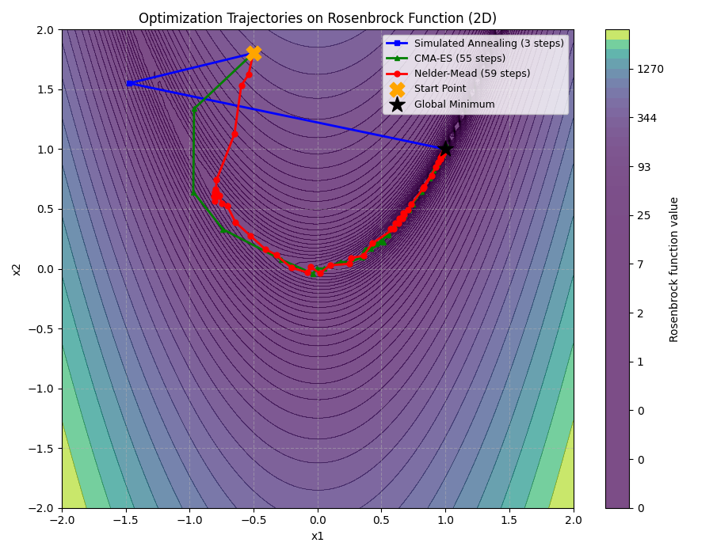

    *Optimization paths on the Rosenbrock function. All methods find the minimum.*

    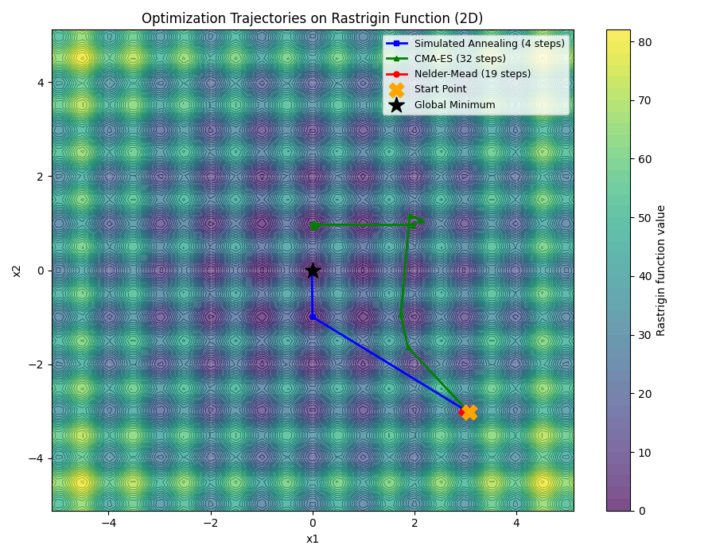

    *Paths on Rastrigin. NM gets stuck locally; SA and CMA-ES approach the global minimum.*

    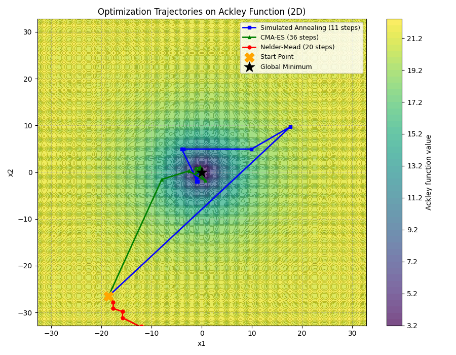
    
    *Paths on Ackley. NM gets stuck locally; SA and CMA-ES find the global minimum.*

*   **Convergence and Accuracy:**

    ```
    ===== Benchmark Performance Summary =====
                                    fevals       final_f      time
    Function   Optimizer                                          
    Rosenbrock Nelder-Mead             180  5.484937e-10  0.003014
               Simulated Annealing    1351  9.729037e-12  0.026972
               CMA-ES                  732  9.093765e-17  0.049240
    Rastrigin  Nelder-Mead              53  1.790920e+01  0.001493 # Failed
               Simulated Annealing    1264  7.105427e-15  0.021167 # Success
               CMA-ES                  612  9.949591e-01  0.044097 # Near Success
    Ackley     Nelder-Mead              81  1.986056e+01  0.001497 # Failed
               Simulated Annealing    1408  1.232890e-08  0.026995 # Success
               CMA-ES                  732  1.215072e-11  0.076287 # Success
    ```

    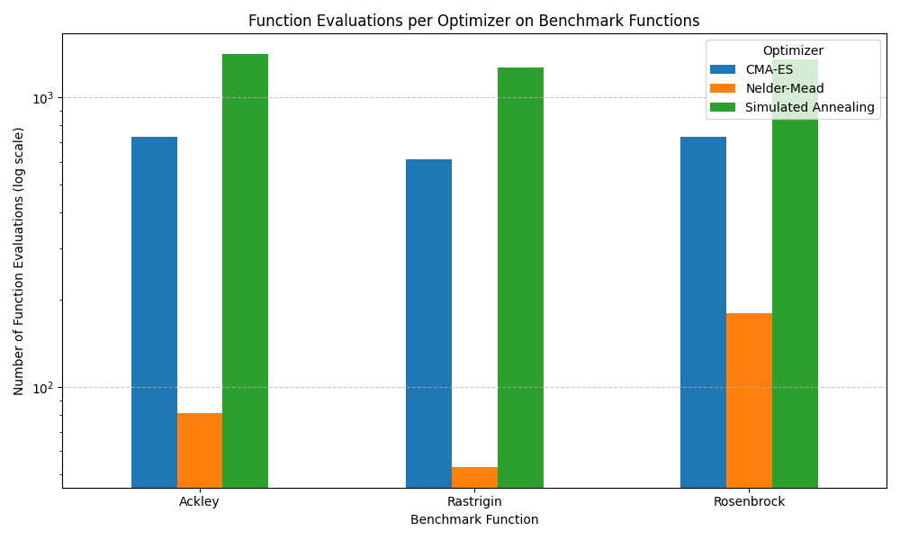
    
    *Function Evaluations per Optimizer on Benchmark Functions (log scale).*

    **Observations (Benchmarks):**
    *   Nelder-Mead was fastest in terms of time but failed completely on multimodal functions (Rastrigin, Ackley), converging to poor local optima with very few evaluations.
    *   Simulated Annealing successfully found the global optimum on all functions but required the most function evaluations.
    *   CMA-ES also successfully found (or got extremely close to) the global optimum on all functions, using significantly fewer evaluations than SA but more than the failed NM runs.

### Task 2: SVM Hyperparameter Tuning

*   **Efficiency and Accuracy:**

    ```
    ===== SVM Tuning Performance Summary =====
    SVM Tuning Results:
                         FEvals   Time (s)  Best Objective (1-CV_Acc)  Final Validation Acc
    Optimizer                                                                           
    Nelder-Mead              59  14.759672                   0.152813              0.816667
    Simulated Annealing     100  17.572145                   0.132839              0.846667
    CMA-ES                  102  16.619977                   0.129996              0.850000
    ```

    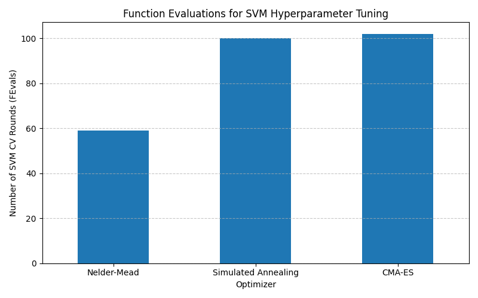
    
    *Function Evaluations (SVM CV Rounds) for Hyperparameter Tuning.*

    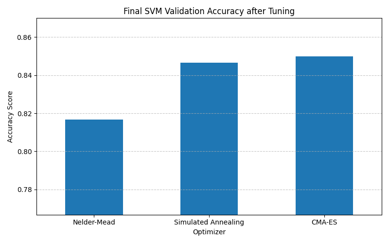

    *Final SVM Validation Accuracy after Tuning.*

*   **Hyperparameter Landscape:**

    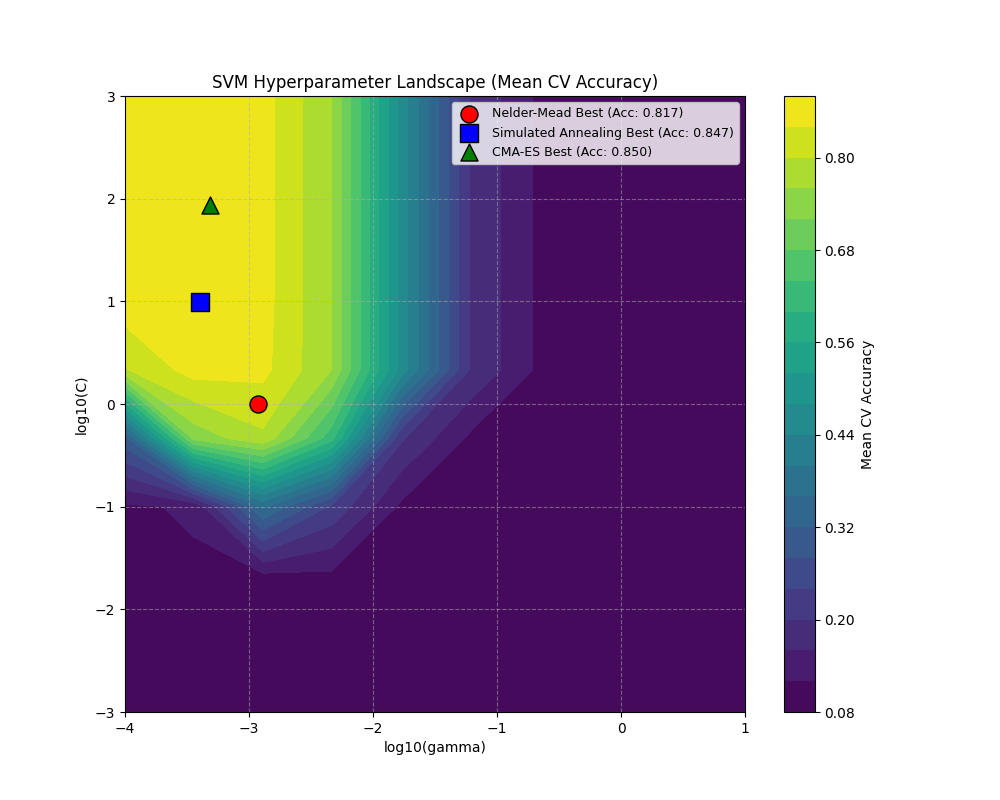

    *SVM Hyperparameter Landscape (Mean CV Accuracy vs log10(gamma), log10(C)) with optimal points found.*

    **Observations (SVM Tuning):**
    *   All methods found reasonable hyperparameters.
    *   Nelder-Mead converged quickest (lowest FEvals/Time) but resulted in the lowest final validation accuracy (81.7%).
    *   Simulated Annealing and CMA-ES used their full evaluation budget and found better hyperparameters, resulting in higher validation accuracy (SA: 84.7%, CMA-ES: 85.0%).
    *   The landscape plot shows a region of high accuracy (yellow). SA and CMA-ES successfully navigated to this region, while NM stopped slightly short. CMA-ES found the parameters yielding the best objective function value (lowest 1-CV_Acc) and highest final accuracy.

## Discussion: Trade-offs of Each Method

*   **Nelder-Mead:** Simple and fast on easy problems, but unreliable on multimodal landscapes due to its purely local search nature. Prone to premature convergence.
*   **Simulated Annealing:** Better at escaping local optima than Nelder-Mead due to its probabilistic acceptance criterion. Can find global optima but often requires many function evaluations and careful tuning of the cooling schedule.
*   **CMA-ES:** Powerful and robust for complex continuous optimization. Adapts its search strategy effectively. Often finds high-quality solutions efficiently compared to SA, but is more complex internally and computationally heavier per step (though often requires fewer steps overall).

**Choice:** Nelder-Mead is suitable for simple problems or local refinement. Simulated Annealing is a good general-purpose global optimizer if complexity is a concern. CMA-ES is often the preferred choice for challenging continuous black-box problems where performance and robustness are critical.

## Conclusion

This project successfully benchmarked Nelder-Mead, Simulated Annealing, and CMA-ES. CMA-ES and SA demonstrated superior performance on multimodal benchmark functions compared to Nelder-Mead, which often got stuck in local optima. In the SVM hyperparameter tuning task, CMA-ES achieved the best final accuracy, closely followed by SA, both finding better parameter regions than the faster-converging Nelder-Mead. The results effectively illustrate the trade-offs between convergence speed, global exploration capability, robustness, and complexity among these common derivative-free optimization techniques.

## How to Run

1.  **Dependencies:** Install required libraries:
    ```bash
    pip install numpy matplotlib scipy scikit-learn pandas tqdm cma openml
    ```
2.  **Execute Notebook:** Run `Problem2_Optimization.ipynb`. Plots will be saved in the `plots/` directory, and results will be printed. (MNIST download and SVM tuning may take some time).
